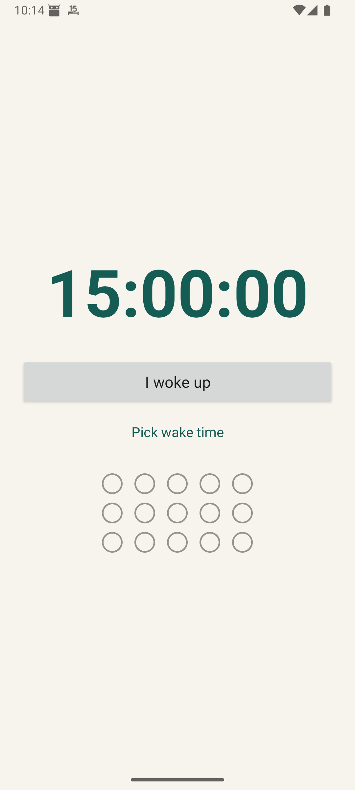

# 15 Hours

A tiny Android countdown for going to sleep on time.



Tap **I woke up** to start a 15-hour countdown. The app keeps the main screen simple, tracks the last 15 sleep outcomes, and only brings back the sleep-deadline notification near the end of the day.

## Build

```sh
gradle :app:assembleRelease
```

The release APK is written to:

```text
app/build/outputs/apk/release/app-release.apk
```
